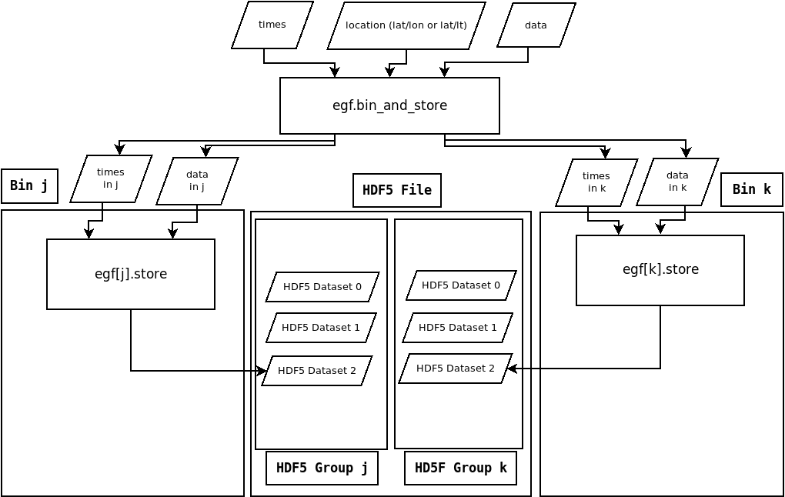
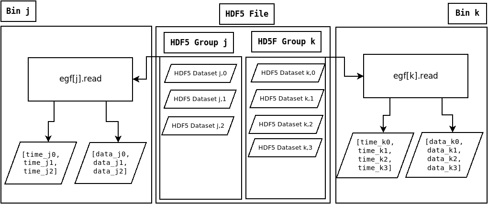

Storage and Retrieval
---------------------

Storing
=======

   This flowchart shows the storage process. :code:`egf` is a 
   :code:`esafile.EsagridFile` instance. :code:`egf[j]` and :code:`egf[k]` 
   are :code:`esafile.EsagridFileBinGroup` instances. The 
   bin_and_store method has been called twice before this call, 
   producing two previous datasets for each bin.

#. Data, with times and locations (all numpy arrays) are passed to the :code:`bin_and_store` method. 
#. Data is divided by bin and passed on to the :code:`store` method for each bin.
#. The data for each bin is stored as an HDF5 Dataset in that bin's HDF5 Group. 

**The average of the times passed with each Dataset is encoded 
as the Dataset name. Individual time values are not stored.**

Retrieving
==========

   This flowchart shows part of the recall process. 
   Here the j-th and k-th :code:`esagrid.EsagridFileBinGroup` 
   objects have different numbers of 'samples' associated with each. 
   Their :code:`read` method returns a list of floating point times 
   associate with each Dataset as well as a
   list of numpy arrays (the data from each dataset).  

.. currentmodule:: esabin.esafile

esabin.esafile
==============

This module implements an HDF5-based data storage/retrieval scheme for binned data.

.. autosummary::

    EsagridFileBinGroup
    EsagridFile

.. autoclass:: esabin.esafile.EsagridFileBinGroup
    :members:

.. autoclass:: esabin.esafile.EsagridFile
    :members: 